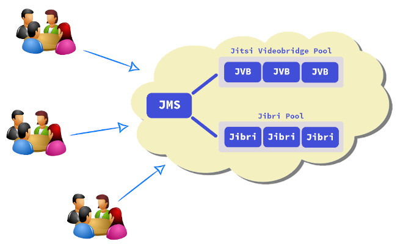

# How to create a Jitsi cluster based on Debian 11 Bullseye

- [1. About](#1-about)
- [2. JMS (Jitsi Meet Server)](#2-jms-jitsi-meet-server)
  - [2.1 Prerequisites](#21-prerequisites)
    - [2.1.1 Machine features](#211-machine-features)
    - [2.1.2 DNS record for JMS](#212-dns-record-for-jms)
    - [2.1.3 DNS record for TURN](#213-dns-record-for-turn)
    - [2.1.4 Public ports](#214-public-ports)
  - [2.2 Installing JMS](#22-installing-jms)
    - [2.2.1 Downloading the installer](#221-downloading-the-installer)
    - [2.2.2 Setting the host addresses](#222-setting-the-host-addresses)
    - [2.2.3 Running the installer](#223-running-the-installer)
    - [2.2.4 Let's Encrypt certificate](#224-lets-encrypt-certificate)
    - [2.2.5 Reboot](#225-reboot)
- [3. Additional JVB (Jitsi Videobridge) node](#3-additional-jvb-jitsi-videobridge-node)
  - [3.1 Prerequisites](#31-prerequisites)
    - [3.1.1 Machine features](#311-machine-features)
    - [3.1.2 Public ports](#312-public-ports)
  - [3.2 Installing JVB](#32-installing-jvb)
    - [3.2.1 Adding the JMS public key](#321-adding-the-jms-public-key)
    - [3.2.2 Adding the JVB node to the pool](#322-adding-the-jvb-node-to-the-pool)
- [4. Additional Jibri node](#4-additional-jibri-node)
  - [4.1 Prerequisites](#41-prerequisites)
    - [4.1.1 Machine features](#411-machine-features)
    - [4.1.2 The snd_aloop module](#412-the-snd_aloop-module)
    - [4.1.3 Public ports](#413-public-ports)
  - [4.2 Installing Jibri](#42-installing-jibri)
    - [4.2.1 Adding the JMS public key](#421-adding-the-jms-public-key)
    - [4.2.2 Adding the Jibri node to the pool](#422-adding-the-jibri-node-to-the-pool)
- [5- FAQ](#5-faq)

## 1. About

This tutorial provides step by step instructions on how to create a Jitsi
cluster based on `Debian 11 Bullseye`.

Create or install a `Debian 11 Bullseye` server for each node in this tutorial.
Please, don't install a desktop environment, only the standard packages...

Run each command on this tutorial as `root`.

## 2. JMS (Jitsi Meet Server)

`JMS` is a standalone server which contains `jitsi-meet`, `prosody`, `jicofo`,
`jvb` and `coturn` services. If the load level is low then `JMS` can operate
without an additional `JVB` node.

Additional `JVB` nodes can be added in the future if needed.

For the server side recording and live streaming features, you will need to add
additional `jibri` nodes.

#### 2.1 Prerequisites

Complete the following steps before starting the `JMS` installation.

##### 2.1.1 Machine features

At least 4 cores and 8 GB RAM

##### 2.1.2 DNS record for JMS

A resolvable host address is required for `JMS` and this address should point to
this server. Therefore, create the DNS `A record` for `JMS` before starting the
installation.

Let's say the host address of `JMS` is `jitsi.mydomain.corp` then the following
command should resolv the server IP address:

```bash
host jitsi.mydomain.corp

>>> jitsi.mydomain.corp has address 1.2.3.4
```

##### 2.1.3 DNS record for TURN

A resolvable host address is required for `TURN` and this address should point
to this server. Therefore, create the DNS `CNAME record` for `TURN` before
starting the installation. The `CNAME record` should be an alias for `JMS` which
is `jitsi.mydomain.corp` in our example.

Let's say the host address of `TURN` is `turn.mydomain.corp` then the following
command should resolv the server IP address:

```bash
host turn.mydomain.corp

>>> turn.mydomain.corp is an alias for jitsi.mydomain.corp.
>>> jitsi.mydomain.corp has address 1.2.3.4
```

##### 2.1.4 Public ports

If the `JMS` server is behind a firewall, open the following ports:

- UDP/10000
- TCP/80
- TCP/443
- TCP/5222 (_if you will have an additional `JVB` or an additional `Jibri`_)

#### 2.2 Installing JMS

##### 2.2.1 Downloading the installer

Download `eb` (_the installer_) and `eb-jitsi.conf` (_the installer config
file_):

```bash
wget -O eb https://raw.githubusercontent.com/emrahcom/emrah-bullseye-base/main/installer/eb
wget -O eb-jitsi.conf https://raw.githubusercontent.com/emrahcom/emrah-bullseye-templates/main/installer/eb-jitsi.conf
```

##### 2.2.2 Setting the host addresses

Set the host addresses on the installer config file `eb-jitsi.conf`. The host
addresses must be FQDN, not IP address... Let's say the host address of `JMS` is
`jitsi.mydomain.corp` and the host address of TURN is `turn.mydomain.corp`

```bash
echo export TURN_FQDN=turn.mydomain.corp >> eb-jitsi.conf
echo export JITSI_FQDN=jitsi.mydomain.corp >> eb-jitsi.conf
```

##### 2.2.3 Running the installer

```bash
bash eb eb-jitsi
```

##### 2.2.4 Let's Encrypt certificate

Let's say the host address of `JMS` is `jitsi.mydomain.corp` and the host
address of `TURN` is `turn.mydomain.corp`. To set the Let's Encrypt certificate:

```bash
set-letsencrypt-cert jitsi.mydomain.corp,turn.mydomain.corp
```

_Be careful, no space between host addresses._

##### 2.2.5 Reboot

Reboot the server

```bash
reboot
```

## 3. Additional JVB (Jitsi Videobridge) node

A standalone `JMS` installation is good for a limited size of concurrent
conferences but the first limiting factor is the `JVB` component, that handles
the actual video and audio traffic. It is easy to scale the `JVB` pool
horizontally by adding as many as `JVB` nodes when needed.

#### 3.1 Prerequisites

Complete the following steps before starting the `JVB` installation.

##### 3.1.1 Machine features

At least 4 cores and 4 GB RAM

##### 3.1.2 Public ports

If the `JVB` server is behind a firewall, open the following ports:

- UDP/10000
- TCP/22 (_at least for `JMS` server_)
- TCP/9090 (_at least for `JMS` server_)

#### 3.2 Installing JVB

##### 3.2.1 Adding the JMS public key

If `openssh-server` is not installed on the `JVB` node, install it first!

```bash
apt-get update
apt-get install openssh-server curl
```

Add the `JMS` public key to the `JVB` node.

```bash
mkdir -p /root/.ssh
chmod 700 /root/.ssh
curl https://jitsi.mydomain.corp/static/jms.pub >> /root/.ssh/authorized_keys
```

##### 3.2.2 Adding the JVB node to the pool

Let's say the IP address of the `JVB` node is `100.1.2.3`. On the `JMS` server:

```bash
add-jvb-node 100.1.2.3
```

## 4. Additional Jibri node

For the server side recording and live streaming features, install additional
`jibri` nodes.

#### 4.1 Prerequisites

Complete the following steps before starting the `Jibri` installation.

##### 4.1.1 Machine features

At least 4 cores and 4 GB RAM

##### 4.1.2 The snd_aloop module

The `Jibri` node needs the `snd_aloop` module. Therefore check the kernel first.
If the following command has an output, this means that the kernel has no
support for `snd-aloop`.

```bash
modprobe snd-aloop
```

##### 4.1.3 Public ports

If the `Jibri` server is behind a firewall, open the following ports:

- TCP/22 (at least for `JMS` server)

#### 4.2 Installing Jibri

##### 4.2.1 Adding the JMS public key

If `openssh-server` is not installed on the `Jibri` node, install it first!

```bash
apt-get update
apt-get install openssh-server curl
```

Add the `JMS` public key to the `Jibri` node.

```bash
mkdir -p /root/.ssh
chmod 700 /root/.ssh
curl https://jitsi.mydomain.corp/static/jms.pub >> /root/.ssh/authorized_keys
```

##### 4.2.2 Adding the Jibri node to the pool

Let's say the IP address of the `Jibri` node is `200.7.8.9`. On the `JMS`
server:

```bash
add-jibri-node 200.7.8.9
```

## 5. FAQ

#### 5.1 My kernel has no support for the snd_aloop module. How can I install the standard Linux kernel?

The cloud kernel used in most cloud machines has no support for the `snd_aloop`
module. Execute the following commands as `root` to install the standart Linux
kernel on a Debian system.

```
apt-get update
apt-get install linux-image-amd64
apt-get purge 'linux-image-*cloud*'
# Abort kernel removal? No
reboot
```

Check the active kernel after reboot

```
uname -a
```

#### 5.2 How can I change the Jitsi config on JMS?

First, connect to the Jitsi container `eb-jitsi` then edit the config files.

```bash
lxc-attach -n eb-jitsi
cd /etc/jitsi
ls
```

#### 5.3 How can I change the videobridge config on the additional JVB?

First, connect to the JVB container `eb-jvb` then edit the config files.

```bash
lxc-attach -n eb-jvb
cd /etc/jitsi/videobridge
ls
```

#### 5.4 I’ve setup the initial JMS node successfully, but getting a 'recording unavailable' error when trying to record.

Setup additional `jibri` nodes. Each `jibri` server should have at least 4 cores
and 4 GB RAM.

#### 5.5 How can I make a change/addition permanent in Jibri?

All running `Jibri` instances are ephemeral and changes made will disappear
after shutdown. Apply to the `eb-jibri-template` container to make a change
permanent and restart the Jibri instances.

#### 5.6 How can I restart all running Jibri instances?

Use the related `systemd` service.

```bash
systemctl stop jibri-ephemeral-container.service
systemctl start jibri-ephemeral-container.service
```

#### 5.7 Where are the recorded files?

`Jibri` creates a randomly named folder for each recording and puts the MP4 file
in it. The recording folder is `/usr/local/eb/recordings` and the MP4 files are
in the subfolders of this folder.

```bash
ls -alh /usr/local/eb/recordings/*
```
